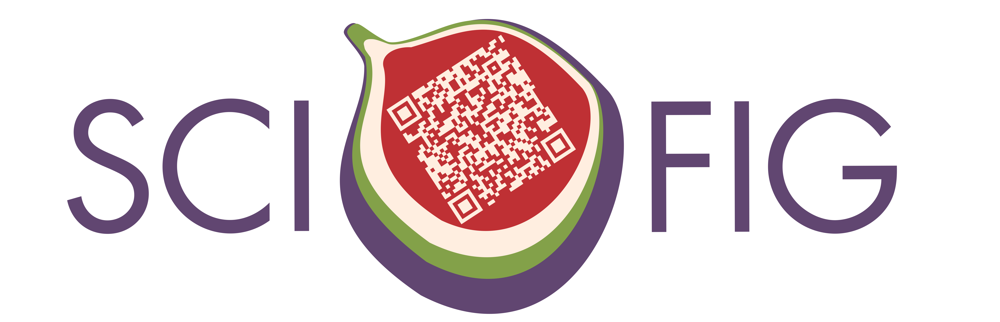

<p align="center">

  <h1 align="center">Explaining scientific findings through figures in publications, presentations, and posters
  </h1>
  <p align="center">
    <a href="https://is.mpg.de/person/rokhmanova"><strong>Nataliya Rokhmanova*</strong></a>
    ·
    <a href="https://hi.is.mpg.de/person/aschulz"><strong>Andrew K. Schulz*</strong></a>
    ·
</p>
<p>
  <p align="center"> 
  
  </p>
  <strong>Spectrum</strong>: *designates equalivant contributions to this GitHub repository.  
</p>

<!-- | Paper Video                                                                                                | Qualitative Results                                                                                                |
|------------------------------------------------------------------------------------------------------------|--------------------------------------------------------------------------------------------------------------------|
| [](https://www.youtube.com/) | -->
## Scientific Figures Syllabus

Learning outcomes for this repository
•	Participants will learn how to critically review their figures through a provided spectrum of figure development and a figure evaluation rubric. 
•	Participants will understand resources for helping with figure construction and key points for figure construction through a figure evaluation rubric. 
•	Participants will understand differences and key components in creating figures for publications, presentations (including TAC meetings), and posters. 


## Overview of Workshop Items and Handouts

This workshop will include several items and documents for you to utilize in your figure-making journal. In this repo, we will provide you with the following tools
- Spectrum of Figure Creation
- Figure Assessment Rubric
- Accessibility, Color Spectrum, Poster, Presentation, and Publication Quick Links and FAQs
- Inkscape 101


<h2 align="center">Spectrum of Figure Creation</h2>

<details>
<p>
  <p align="center"> 
  
  </p>
  <strong>Spectrum</strong>: The spectrum is the spectrum and it's nice  
</p>
  <summary>Details</summary>
In the folder, we provided information on the spectrum of figure creation, including figures from 1 to 5.
</details>

[comment]: <> (## Running the Demo)

[comment]: <> (We have prepared a nice demo. )

<h2 align="center">Figure Assessment Rubric</h2>
 <details>
<p>
  <p align="center"> 
  
  </p>	 
  <summary>Details</summary>
In this folder, we highlight information on specific assessments of figures in the presentation, publication, and poster formats. The overarching theme for the rubric are as follows:
	 - Color Scheme
	 - Clarity
	 - Readability
	 - Plot Type
	 - Ink/Content Ratio
	 - Accessibility
</details>

<h2 align="center">Quick Links and FAQs </h2>

 <details>
  <summary>Details</summary>

We highlight quick links and frequently asked questions or FAQs in this folder. There are links for the following resources:
- Poster Creation Guide
- Presentation Guide
- Scientific Storytelling
- Creating Figures for Publication
- Open-source figure crafting tools

</details>

<h2 align="center">Inkscape 101 </h2>

<details>
<summary>Installing Inkscape</summary>

Inkscape is a free and open-source software licensed under the [GPL](https://www.gnu.org/licenses/old-licenses/gpl-2.0.html). To download Inkscape, you can go to their website:
```
https://inkscape.org/
```

 
</details>

 <details>
  <summary>Details</summary>

During this workshop we will be working 
- How to Inkscape

</details>

## Citation

```bibtex
@techreport{rokhmanova_explaining_2023,
	address = {Scientific Figures},
	title = {Explaining scientific findings through figures in publications, presentations, and posters},
	author = {Rokhmanova, Nataliya and Schulz, Andrew K.},
	year = {2023},
}

```
## License
The information on this GitHub is attributed to a CC BY-NC license. 

## Open Source
All items in this workshop are open-source and follow the ten definitions of Open Source included on `https://opensource.org/osd/`

These items can be shared with lab groups and departments, and all files are accessible to be shared. 

## Acknowledgements
Many parts of this workshop reference a previous GitHub made by co-presenter NR: [FiguresDemo2022](https://github.com/nrokh/FiguresDemo2022). The QR code for the logo and this GitHub repo were made using the python tutorial from sahil_rajput: [PythonQR](https://www.geeksforgeeks.org/python-generate-qr-code-using-pyqrcode-module/). For the figure spectrum, we utilized a Kaggle data set: [Eurovision Song Contest scores 1975-2019](https://www.kaggle.com/datasets/datagraver/eurovision-song-contest-scores-19752019). 

The authors thank the International Max Planck Research School for Intelligent Systems, [IMPRS-IS](https://imprs.is.mpg.de/) for supporting NR and AKS. The authors thank Brooke Christensen for the contribution materials utilized in making these resources. Thanks to [Katherine J. Kuchenbecker](https://is.mpg.de/~kjk) for support and feedback.

## Contact 

This code repository was implemented by [Nataliya Rokhmanova](https://github.com/nrokh) and [Andrew Schulz](https://github.com/Aschulz94). 

Give a ⭐ if you like.

