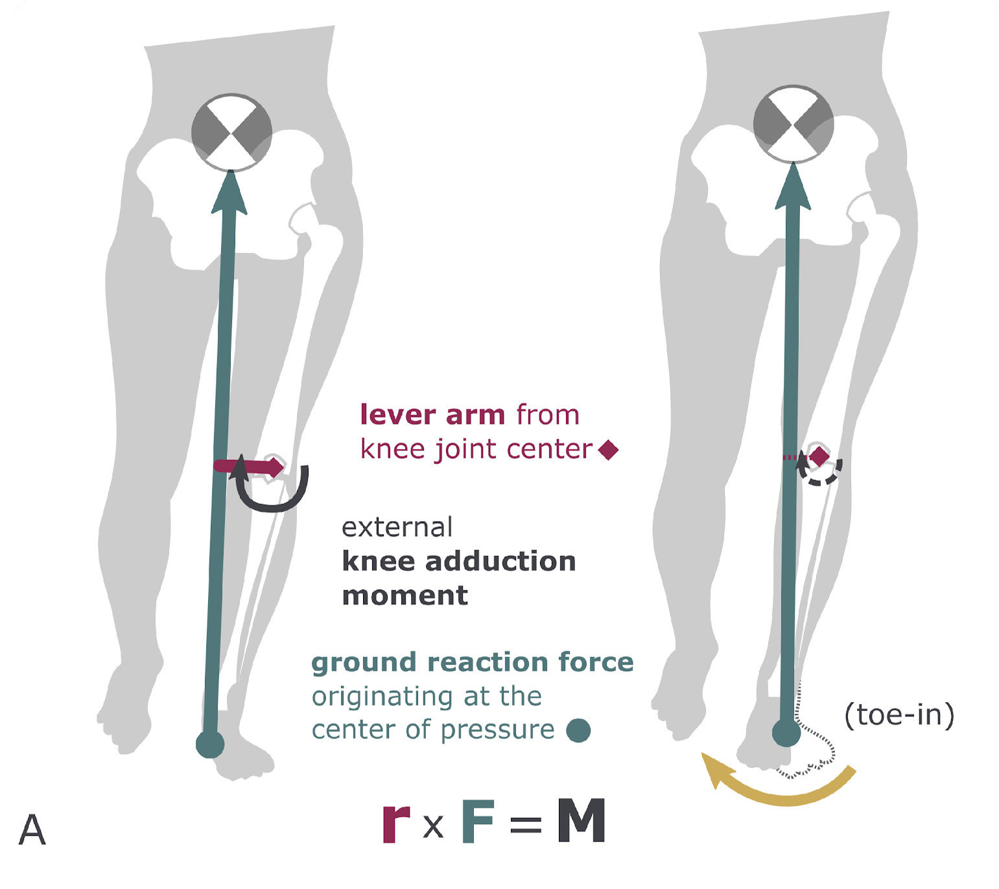

#IMPRSFiguresWorkshop
 

<p align="center">

  <h1 align="center">Explaining scientific findings through figures in publications, presentations, and posters
  </h1>
  <p align="center">
    <a href="https://is.mpg.de/person/rokhmanova"><strong>Nataliya Rokhmanova*</strong></a>
    ·
    <a href="https://hi.is.mpg.de/person/aschulz"><strong>Andrew K. Schulz*</strong></a>
    ·
</p>
<p float="center">
  <div align="center">
  
  </div>
</p>

<!-- | Paper Video                                                                                                | Qualitative Results                                                                                                |
|------------------------------------------------------------------------------------------------------------|--------------------------------------------------------------------------------------------------------------------|
| [](https://www.youtube.com/) | -->

## Overview of Workshop Items

This workshop will include several items and documents for you to utilize in your figure making journal. In this repo we will provide you with the following tools
- Spectrum of Figure Creation
- Figure Assessment Rubric
- Poster, Presentation, Publication Quick Links and FAQs
- Quick start guide to Inkscape and other Open-source figure tools
- Figure Accessibility Guide

All items in this workshop are open-source and follow the ten definitions of Open Source included on `https://opensource.org/osd/`

<h2 align="center">Spectrum of Figure Creation</h2>

<details>
<p>
  <p align="center"> 
  
  </p>
  <strong>TEMPEH</strong>: Given calibrated multi-view images (top: 4 of 16 views; contrast enhanced for visualization), TEMPEH directly infers 3D head meshes in dense semantic correspondence (bottom) in about 0.3 seconds. TEMPEH reconstructs heads with varying expressions (left) and head poses (right) for subjects unseen during training. Applied to multi-view video input, the frame-by-frame inferred meshes are temporally coherent, making them directly applicable to full-head performance-capture applications.   
</p>
  <summary>Details</summary>
In the folder, we provided information on the spectrum of figure creation, including figures from 1 to 5.

You can do something equivalent with `conda` as well.
</details>

[comment]: <> (## Running the Demo)

[comment]: <> (We have prepared a nice demo code to run SINC on arbitrary videos. )

<h2 align="center">Figure Assessment Rubric</h2>

 <details>
  <summary>Details</summary>
In this folder, we highlight information on specific assessments of figures in the presentation, publication, and poster formats. The overarching theme for the rubric are as follows:
	 - Color Scheme
	 - Clarity
	 - Readability
	 - Plot Type
	 - Ink/Content Ratio
	 - Accessibility
</details>

<h2 align="center">Quick Links and FAQs </h2>

 <details>
  <summary>Details</summary>

We highlight quick links and frequently asked questions or FAQs in this folder. There are links for the following resources:
- Poster Creation Guide
- Presentation Guide
- Scientific Storytelling
- Creating Figures for Publication
- Open-source figure crafting tools

</details>

<h2 align="center">Open-Source Figure Making </h2>

 <details>
  <summary>Details</summary>

We highlight quick links and frequently asked questions or FAQs in this folder. There are links for the following resources:
- How to Inkscape

</details>

## Citation

```bibtex
@techreport{rokhmanova_explaining_2023,
	address = {IMPRS IS Bootcamp},
	title = {Explaining scientific findings through figures in publications, presentations, and posters},
	author = {Rokhmanova, Nataliya and Schulz, Andrew K.},
	year = {2023},
}

```
## License
This information is for all researchers, scientists to use for their figure creation. 

## References
Many parts of this workshop reference a previous GitHub made by co-present NR: [FiguresDemo2022](https://github.com/nrokh/FiguresDemo2022).

## Contact

This code repository was implemented by [Nataliya Rokhmanova](https://github.com/nrokh) and [Andrew Schultz](https://github.com/Aschulz94). 

Give a ⭐ if you like.

