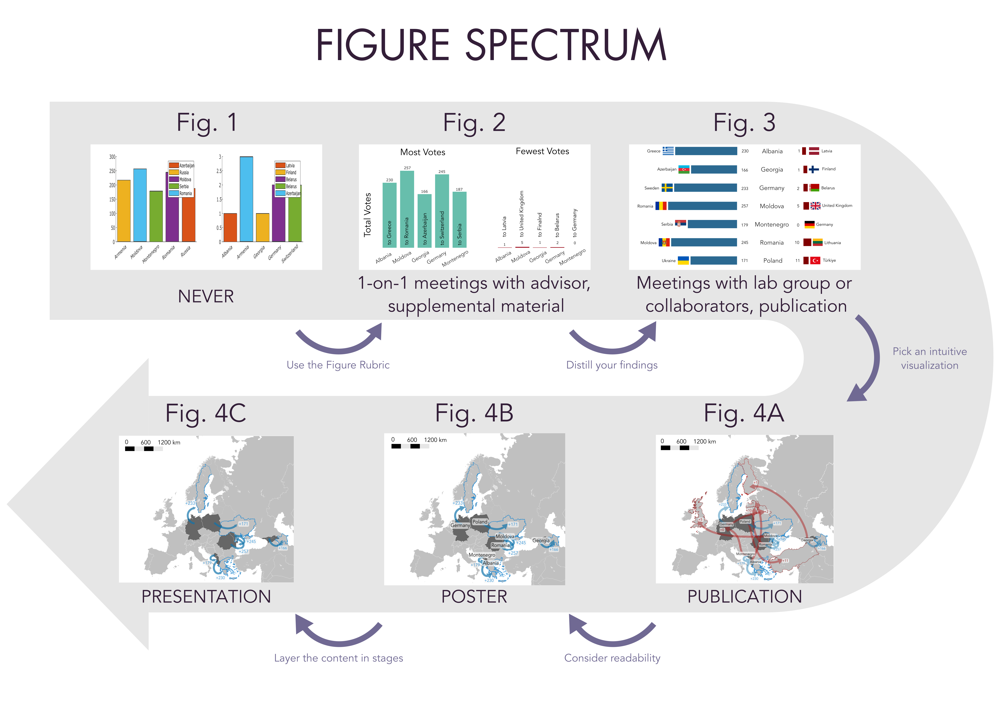

<p align="center">

  <h1 align="center">Explaining scientific findings through figures in publications, presentations, and posters
  </h1>
  <p align="center">
    <a href="https://is.mpg.de/person/rokhmanova"><strong>Nataliya Rokhmanova*</strong></a>
    ·
    <a href="https://hi.is.mpg.de/person/aschulz"><strong>Andrew K. Schulz*</strong></a>
    ·
</p>
<p>
  <p align="center"> 
  
  </p>
  <strong>*</strong> designates equivalent contributions to this GitHub repository. The above logo can be found <a href="https://github.com/nrokh/ScientificFigures/tree/main/media">here</a>. 
</p>

<!-- | Paper Video                                                                                                | Qualitative Results                                                                                                |
|------------------------------------------------------------------------------------------------------------|--------------------------------------------------------------------------------------------------------------------|
| [](https://www.youtube.com/) | -->
## SciFig Learning Outcomes for Users

Learning outcomes for using this repository:
- Participants will learn how to critically review their figures using the provided spectrum of figure development and a figure evaluation rubric.
- Participants will understand what resources are available to help with figure construction.
- Participants will understand differences and key components between creating figures for publications, presentations (including Thesis Advisory Committee meetings), and posters. 


## Overview of Workshop Items and Handouts

This workshop will include several items and documents for you to use in your figure-making journey. In this repo, we will provide you with the following tools
- [Spectrum of Figure Creation](https://github.com/nrokh/ScientificFigures/blob/main/README.md#spectrum-of-figure-creation)
- [Figure Assessment Rubric](https://github.com/nrokh/ScientificFigures/blob/main/README.md#figure-assessment-rubric)
- [SciFigs Helpful Links and FAQs](https://github.com/nrokh/ScientificFigures/blob/main/README.md#quick-links-and-faqs-)
- [Inkscape 101](https://github.com/nrokh/ScientificFigures/blob/main/README.md#inkscape-101-)
- Running your own workshop (coming soon...)


<h2 align="center">Spectrum of Figure Creation</h2>

<details>
	
The spectrum contains multiple figures to help scientists understand the iterative process for creating scientific visualizations. The figures are arranged in the following order:
- Spectrum of Figure Creation
	- Figure 1: The worst figure you (hopefully) will ever see. Nobody ever needs to see another figure like this one. 
	- Figure 2: The same data and the same plot type from Figure 1 are now reworked into a more professional version. 
	- Figure 3: After careful consideration of the _data_, this figure combines the two subplots from Figure 2 to create a comprehensive and easy-to-interpret view.
	- Figure 4: After careful consideration of the _plot type_, this series of figures represents the data using a plot type that matches the data type. 
		- Figure 4a: This is a figure that would be appropriate for a publication, where the reader has lots of time to engage, think, and read fine-print.
		- Figure 4b: This is a figure that would be better suited for a poster, which should present distilled content and be readable at different distances.
 		- Figure 4c: This is a figure that would be best for a presentation, where it complements the content that you are describing verbally as you proceed through the talk.

There is something to learn about each figure, and each lesson is supplemented by the Figure Rubric included in the following section. The Figure Spectrum is previewed below: 
<p>
  <p align="center"> 
  
  </p>
</p>
The .png, .svg. and .pdf versions of this figure, as well as each sub-figure (Fig.1-4) can be found <a href="https://github.com/nrokh/ScientificFigures/tree/ad717a0e35d72456f1fbf443395fb6ab542574c8/FigureSpectrum">here</a>.
</details>

[comment]: <> (## Running the Demo)

[comment]: <> (We have prepared a nice demo. )

<h2 align="center">Figure Assessment Rubric</h2>
 <details>

In the Figure Rubric, we highlight six key attributes to help assess figures for presentations, publications, and posters. The six attributes are:
- Scale & Resolution
- Units & Labels
- Colors
- Emphasis
- Ink:Content Ratio
- Accessibility

The rubric shows examples of each attribute done well and done poorly, as well as a few pointers to keep in mind. 

  <p>
  <p align="center"> 
  
  
  </p>
The .png, .svg. and .pdf versions of this rubric can be found <a href="https://github.com/nrokh/ScientificFigures/tree/7adb50915035029c4f42836f69965cf805202563/FigureRubric">here</a>.  
</details>

<h2 align="center">Quick Links and FAQs </h2>

 <details>
	 
We highlight some useful links and frequently asked questions (FAQs) in this handout. There are links for the following resources:
- Poster creation
- Presentations
- Scientific storytelling
- Creating figures for publication
- Open-source figure-crafting tools

The link sheet can be found <a href="https://github.com/nrokh/ScientificFigures/tree/e13819c333c6a333dc4a2dde96fdfe8c264389c4/LinksAndFAQs">here</a>.
</details>

<h2 align="center">Inkscape 101 </h2>

<details>
<summary>Installing Inkscape</summary>

Inkscape is a free open-source software licensed under the [GPL](https://www.gnu.org/licenses/old-licenses/gpl-2.0.html). To download Inkscape, you can go to their website:
```
https://inkscape.org/
```
Additionally, you can directly download Inkscape across all platforms [here](https://inkscape.org/release/1.3/platforms/), or at the following web address for Linux, Windows, or MacOS:
```
https://inkscape.org/release/1.3/platforms/
```
Once Inkscape is downloaded, it will automatically be available as an application on your desktop. 
</details>

 <details>
  <summary>Details</summary>
In this workshop, we explain how to take a plot exported from <a href="https://github.com/nrokh/ScientificFigures/blob/3777608834b74cf38e7a80259ed103772b47934a/Inkscape101/coffeeCupPlotting.m">MATLAB</a> as an <a href="https://github.com/nrokh/ScientificFigures/blob/3777608834b74cf38e7a80259ed103772b47934a/Inkscape101/coffeePlot.svg">.svg</a>, import it into Inkscape, and revise it based on the six key attributes listed in the Figure Rubric. Time-permitting, we explain how to create simple vector graphics using a <a href="https://github.com/nrokh/ScientificFigures/blob/3777608834b74cf38e7a80259ed103772b47934a/Inkscape101/CoffeeCup.jpg">photograph</a> as a guide. 
</details>

<h2 align="center">Running your own tutorial </h2>
<details>

 
We learned a lot while planning and executing this workshop. Some tips on how to run your own tutorial will be coming soon. If you want to share this content with your colleagues by holding your own tutorial, we will provide the following teaching materials:
- Lesson plan for a two-hour workshop for a lab group, department, etc.
- Slides for a two hour workshop as both PowerPoint and PDF files
- Sli.do poll questions
- Example survey questions for feedback on how to improve the workshop
</details>
 
## Citation

```bibtex
@misc{rokhmanova_explaining_2023,
	address = {Scientific Figures},
	title = {Explaining scientific findings through figures in publications, presentations, and posters},
	author = {Rokhmanova, Nataliya and Schulz, Andrew K.},
	howpublished = {Workshop at the International Max Planck Research School for Intelligent Systems (IMPRS-IS) Fall 2023 Bootcamp},
	year = {2023},
}

```
## License
The information on this GitHub is attributed to a CC BY-NC license. 

## Open Source
All items in this workshop are open-source and follow the ten definitions of Open Source included on `https://opensource.org/osd/`

These items can be shared with lab groups and departments, and all files are accessible to be shared. 

## Acknowledgements
Many parts of this workshop reference a previous GitHub made by co-presenter NR: [FiguresDemo2022](https://github.com/nrokh/FiguresDemo2022). The QR code for the logo and this GitHub repo were made using the Python tutorial from sahil_rajput: [PythonQR](https://www.geeksforgeeks.org/python-generate-qr-code-using-pyqrcode-module/). For the figure spectrum, we utilized a Kaggle data set: [Eurovision Song Contest scores 1975-2019](https://www.kaggle.com/datasets/datagraver/eurovision-song-contest-scores-19752019). We thank J. Burns for his assistance in preparing the content for this GitHub. Finally, we thank all of the authors and contributors to Inkscape who are listed [here](https://inkscape.org/credits/). 

The authors thank the International Max Planck Research School for Intelligent Systems, [IMPRS-IS](https://imprs.is.mpg.de/) for supporting NR and AKS. The authors thank Brooke Christensen for the contribution materials utilized in making these resources. Thanks to [Katherine J. Kuchenbecker](https://is.mpg.de/~kjk) for support and feedback.

## Contact 

This code repository was implemented by [Nataliya Rokhmanova](https://github.com/nrokh) and [Andrew Schulz](https://github.com/Aschulz94). 

Give a ⭐ if you like.

